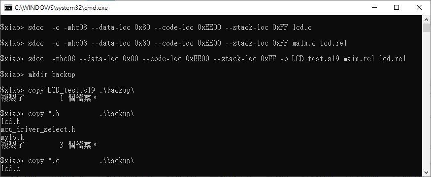

# HC08_LCD_HD44780_AN2940_SDCC
copy and rewrite the code, port to sdcc 3.9.0 and QT device

notes:
### 1) removed dependency hidef.h, rewrite EnableInterrupt, inline asm or uses macro of myio.h, see main.c
```
  //EnableInterrupts;         // Enable interrupts, original CW code, not working for sdcc 3.9.0
  __asm CLI; __endasm;        // sdcc 3.9.0
//  GLOBAL_INTERRUPT_ENABLE;  // same as above, uses macro, see myio.h
```
  
    
### 2) rewrite code to fit for QT device & sdcc 3.9.0, NXP/Freescale and original code was for AP device, see mcu_driver_select.h
```
/* Select the Correctly Driver for your MicroControllerUnit */
#ifndef MC68HC908AP64_h
    #define MC68HC908AP64_h
    //#include <MC68HC908AP64.h>	/* Include peripheral declarations */ for Codeworrier
    //#include <mc68hc908apxx.h>  /* include for sdcc 3.9.0, by xiaolaba
    #include <mc68hc908qy.h>

#endif
```

  
### 3) uses own build.bat as scrpting tool to build firmware image as [lcd_test.s19](lcd_test.s19)
no error, no warning  
  

  
    
  
### 4) rewrite lcd.h, for sdcc 3.9.0 and QT device  
```
//  for QT2, sdcc 3.9.0
  #define lcdE        PTA5     /* Enabled pin of LCD                     */
  #define lcdEDD      DDRA5   /* Data Direction of Enabled Pin          */
  #define lcdRS       PTA4     /* RS pin of LCD (Data/Instruction Select)*/
  #define lcdRSDD     DDRA4   /* Data Direction of RS Pin               */
  #define lcdPort     PTA          /* Port of 4 data bits to lcd connection  */
  #define lcdPortDD   DDRA         /* Data direction for 4 data pins         */
```

### 5) removed dependency start08.c  
### 6) original_source_code, AN2940SW, part of original source code by NXP, register and download AN2940SW.zip, will see. 
  
  
  

## The original source code and application note. it has been designed for propritary software CodeWarrior® for Microcontrollers (Classic IDE) - RS08/HC(S)08, ColdFire V1 v6.3  
  
https://www.nxp.com/webapp/sps/download/license.jsp?colCode=AN2940SW  
https://www.nxp.com/docs/en/application-note/AN2940.pdf

